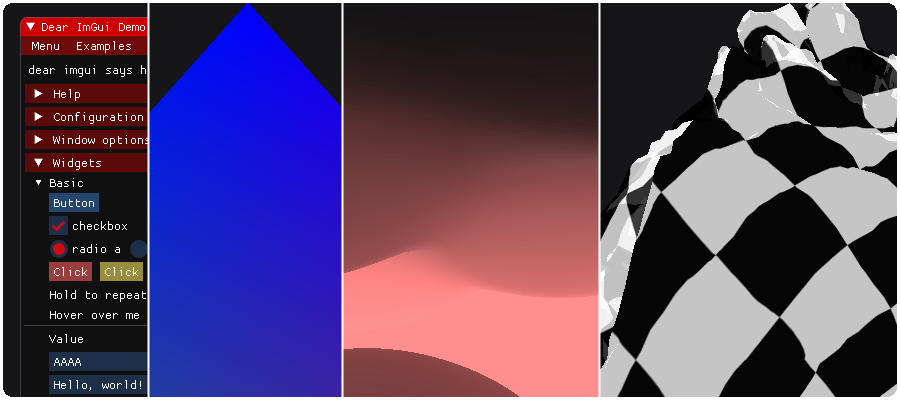

<a href="https://lava-block.com"></a>

# liblava docs &nbsp; [](https://git.io/liblava)

[Features](#features) &nbsp; **[Tutorial](#tutorial)** &nbsp; [Modules](#modules) &nbsp; **[Guide](#guide)** &nbsp; [Tests](#tests) &nbsp; **[Build](#build)** &nbsp; [Install](#install)

<br />

## Features

*WIP*

<br />

## Tutorial

<a href="https://www.khronos.org/vulkan/" target="_blank"></a>

Let's write **Hello World** in Vulkan...

<br />

**"a simple app that renders a colored window"**

➜ All we need is a `window` + `device` and `renderer`

<br />

**Vulkan** is a low-level, verbose graphics API and such a program can take several hundred lines of code

The good news is that **liblava** will help you!

```c++
#include <liblava/lava.hpp>

using namespace lava;
```
<br />

⬇ Here are a few examples to get to know `lava`

<br />

#### 1. frame init

```c++
int main(int argc, char* argv[]) {

    lava::frame frame( {argc, argv} );
    
    return frame.ready() ? 0 : error::not_ready;
}
```

This is how to initialize `lava frame` with command line arguments

<br />

#### 2. run loop

```c++
lava::frame frame(argh);
if (!frame.ready())
    return error::not_ready;

auto count = 0;

frame.add_run([&]() {
    sleep(one_second);
    count++;

    log()->debug("{} - running {} sec", count, frame.get_running_time_sec());

    if (count == 3)
        return frame.shut_down();

    return run_continue;
});

return frame.run();
```

The last line performs a loop with the **run** we added before - If *count* reaches 3 that **loop** will exit

<br />

#### 3. window input

Here is another example that shows how to create a `lava window` and handle `lava input`

```c++
lava::frame frame(argh);
if (!frame.ready())
    return error::not_ready;

lava::window window;
if (!window.create())
    return error::create_failed;

lava::input input;
window.assign(&input);

input.key.listeners.add([&](key_event::ref event) {
    if (event.pressed(key::escape))
        return frame.shut_down();
    
    return input_ignore;
});

frame.add_run([&]() {
    input.handle_events();

    if (window.close_request())
        frame.shut_down();

    return run_continue;
});

return frame.run();
```

<br />

Straightforward ➜ With this knowledge in hand let's write our **Hello World** now...

#### 4. clear color

```c++
lava::frame frame(argh);
if (!frame.ready())
    return error::not_ready;

lava::window window;
if (!window.create())
    return error::create_failed;

lava::input input;
window.assign(&input);

input.key.listeners.add([&](key_event::ref event) {
    if (event.pressed(key::escape))
        return frame.shut_down();

    return input_ignore;
});

auto device = frame.create_device();
if (!device)
    return error::create_failed;

auto render_target = create_target(&window, device);
if (!render_target)
    return error::create_failed;

lava::renderer plotter;
if (!plotter.create(render_target->get_swapchain()))
    return error::create_failed;

auto frame_count = render_target->get_frame_count();

VkCommandPool cmd_pool;
VkCommandBuffers cmd_bufs(frame_count);

auto build_cmd_bufs = [&]() {
    if (!device->vkCreateCommandPool(device->graphics_queue().family, &cmd_pool))
        return build_failed;

    if (!device->vkAllocateCommandBuffers(cmd_pool, frame_count, cmd_bufs.data()))
        return build_failed;

    VkCommandBufferBeginInfo const begin_info{
        .sType = VK_STRUCTURE_TYPE_COMMAND_BUFFER_BEGIN_INFO,
        .flags = VK_COMMAND_BUFFER_USAGE_SIMULTANEOUS_USE_BIT,
    };

    VkClearColorValue const clear_color = { random(1.f), random(1.f), random(1.f), 0.f };

    VkImageSubresourceRange const image_range{
        .aspectMask = VK_IMAGE_ASPECT_COLOR_BIT,
        .levelCount = 1,
        .layerCount = 1,
    };

    for (auto i = 0u; i < frame_count; i++) {
        auto cmd_buf = cmd_bufs[i];
        auto frame_image = render_target->get_image(i);

        if (failed(device->call().vkBeginCommandBuffer(cmd_buf, &begin_info)))
            return build_failed;

        insert_image_memory_barrier(device, cmd_buf, frame_image,
                                    VK_ACCESS_MEMORY_READ_BIT, VK_ACCESS_TRANSFER_WRITE_BIT,
                                    VK_IMAGE_LAYOUT_UNDEFINED, VK_IMAGE_LAYOUT_TRANSFER_DST_OPTIMAL,
                                    VK_PIPELINE_STAGE_TRANSFER_BIT, VK_PIPELINE_STAGE_TRANSFER_BIT,
                                    image_range);

        device->call().vkCmdClearColorImage(cmd_buf, frame_image, VK_IMAGE_LAYOUT_TRANSFER_DST_OPTIMAL,
                                            &clear_color, 1, &image_range);

        insert_image_memory_barrier(device, cmd_buf, frame_image,
                                    VK_ACCESS_TRANSFER_WRITE_BIT, VK_ACCESS_MEMORY_READ_BIT,
                                    VK_IMAGE_LAYOUT_TRANSFER_DST_OPTIMAL, VK_IMAGE_LAYOUT_PRESENT_SRC_KHR,
                                    VK_PIPELINE_STAGE_TRANSFER_BIT, VK_PIPELINE_STAGE_BOTTOM_OF_PIPE_BIT,
                                    image_range);

        if (failed(device->call().vkEndCommandBuffer(cmd_buf)))
            return build_failed;
    }

    return build_done;
};

auto clean_cmd_bufs = [&]() {
    device->vkFreeCommandBuffers(cmd_pool, frame_count, cmd_bufs.data());
    device->vkDestroyCommandPool(cmd_pool);
};

if (!build_cmd_bufs())
    return error::create_failed;

render_target->on_swapchain_start = build_cmd_bufs;
render_target->on_swapchain_stop = clean_cmd_bufs;

frame.add_run([&]() {
    input.handle_events();

    if (window.close_request())
        return frame.shut_down();

    if (window.resize_request())
        return window.handle_resize();

    auto frame_index = plotter.begin_frame();
    if (!frame_index)
        return run_continue;

    return plotter.end_frame({ cmd_bufs[*frame_index] });
});

frame.add_run_end([&]() {
    clean_cmd_bufs();

    plotter.destroy();
    render_target->destroy();
});

return frame.run();
```

##### Welcome on **Planet Vulkan** - That's a lot to display a colored window!

<br />

Phew! Take a closer look at the `build_cmd_bufs` function:

* We create a **command pool** and **command buffers** for each frame of the render target
* And set each command buffer to clear the frame image with some random color

<br />

The *VK_COMMAND_BUFFER_USAGE_SIMULTANEOUS_USE_BIT* flag specifies the reusage of command buffers

`clean_cmd_bufs` frees all buffers and destroys the command pool

In case of swap chain restoration we simply recreate command buffers with a new random color

This happens for example on window resize

<br />

After all, this is a very static example 

➜ Vulkan supports a more *dynamic* and common usage by resetting a command pool before recording new commands

<br />

Ok, it's time for... `lava block`

#### 5. color block

```c++
lava::block block;

if (!block.create(device, frame_count, device->graphics_queue().family))
    return error::create_failed;

block.add_command([&](VkCommandBuffer cmd_buf) {
    VkClearColorValue const clear_color = { random(1.f), random(1.f), random(1.f), 0.f };

    VkImageSubresourceRange const image_range{
        .aspectMask = VK_IMAGE_ASPECT_COLOR_BIT,
        .levelCount = 1,
        .layerCount = 1,
    };

    auto frame_image = render_target->get_image(block.get_current_frame());

    insert_image_memory_barrier(device, cmd_buf, frame_image,
                                VK_ACCESS_MEMORY_READ_BIT, VK_ACCESS_TRANSFER_WRITE_BIT,
                                VK_IMAGE_LAYOUT_UNDEFINED, VK_IMAGE_LAYOUT_TRANSFER_DST_OPTIMAL,
                                VK_PIPELINE_STAGE_TRANSFER_BIT, VK_PIPELINE_STAGE_TRANSFER_BIT,
                                image_range);

    device->call().vkCmdClearColorImage(cmd_buf, frame_image, VK_IMAGE_LAYOUT_TRANSFER_DST_OPTIMAL,
                                        &clear_color, 1, &image_range);

    insert_image_memory_barrier(device, cmd_buf, frame_image,
                                VK_ACCESS_TRANSFER_WRITE_BIT, VK_ACCESS_MEMORY_READ_BIT,
                                VK_IMAGE_LAYOUT_TRANSFER_DST_OPTIMAL, VK_IMAGE_LAYOUT_PRESENT_SRC_KHR,
                                VK_PIPELINE_STAGE_TRANSFER_BIT, VK_PIPELINE_STAGE_BOTTOM_OF_PIPE_BIT,
                                image_range);
});
```

##### Nice, this is much more simpler than before!

<br />

We create a `lava block` and add just one **command** that clears the current frame image

<br />

All we need to do now is to process the block in the run loop:

```c++
if (!block.process(*frame_index))
    return run_abort;

return plotter.end_frame(block.get_buffers());
```

And call the renderer with our recorded command buffers

<br />

Don't forget to clean it up:

```c++
block.destroy();
```

<br />

##### New to Vulkan? Take a look at this [Vulkan Guide](https://github.com/KhronosGroup/Vulkan-Guide)

Check [Awesome Vulkan ecosystem](http://www.vinjn.com/awesome-vulkan/) for tutorials, samples and books

<br />

#### 8. imgui demo

Out of blocks `lava app` supports [Dear ImGui](https://github.com/ocornut/imgui) for **tooling** and **easy prototyping**:

```c++
int main(int argc, char* argv[]) {

    lava::app app("demo", { argc, argv });
    if (!app.setup())
        return error::not_ready;

    app.gui.on_draw = []() {
        ImGui::ShowDemoWindow();
    };

    return app.run();
}
```

<br />

##### What's next? ➜ Check some <a href="https://git.io/liblava-demo">demos</a> and clone a <a href="https://git.io/liblava-template">starter template</a> to try it out!

<a href="https://github.com/liblava/liblava-demo/#readme"></a>

<br />

## Modules

#### lava [app](https://github.com/liblava/liblava/tree/master/liblava/app)

[](https://github.com/liblava/liblava/tree/master/liblava/app/app.hpp) [](https://github.com/liblava/liblava/tree/master/liblava/app/camera.hpp) [](https://github.com/liblava/liblava/tree/master/liblava/app/forward_shading.hpp) [](https://github.com/liblava/liblava/tree/master/liblava/app/gui.hpp)

#### lava [block](https://github.com/liblava/liblava/tree/master/liblava/block)

[](https://github.com/liblava/liblava/tree/master/liblava/block/attachment.hpp) [](https://github.com/liblava/liblava/tree/master/liblava/block/block.hpp) [](https://github.com/liblava/liblava/tree/master/liblava/block/descriptor.hpp) [](https://github.com/liblava/liblava/tree/master/liblava/block/pipeline.hpp) [](https://github.com/liblava/liblava/tree/master/liblava/block/render_pass.hpp) [](https://github.com/liblava/liblava/tree/master/liblava/block/subpass.hpp)

#### lava [frame](https://github.com/liblava/liblava/tree/master/liblava/frame)

[](https://github.com/liblava/liblava/tree/master/liblava/frame/frame.hpp) [](https://github.com/liblava/liblava/tree/master/liblava/frame/input.hpp) [](https://github.com/liblava/liblava/tree/master/liblava/frame/render_target.hpp) [](https://github.com/liblava/liblava/tree/master/liblava/frame/renderer.hpp) [](https://github.com/liblava/liblava/tree/master/liblava/frame/swapchain.hpp) [](https://github.com/liblava/liblava/tree/master/liblava/frame/window.hpp)

#### lava [asset](https://github.com/liblava/liblava/tree/master/liblava/asset)

[](https://github.com/liblava/liblava/tree/master/liblava/asset/mesh_loader.hpp) [](https://github.com/liblava/liblava/tree/master/liblava/asset/scope_image.hpp) [](https://github.com/liblava/liblava/tree/master/liblava/asset/texture_loader.hpp)

#### lava [resource](https://github.com/liblava/liblava/tree/master/liblava/resource)

[](https://github.com/liblava/liblava/tree/master/liblava/resource/buffer.hpp) [](https://github.com/liblava/liblava/tree/master/liblava/resource/format.hpp) [](https://github.com/liblava/liblava/tree/master/liblava/resource/image.hpp) [](https://github.com/liblava/liblava/tree/master/liblava/resource/mesh.hpp) [](https://github.com/liblava/liblava/tree/master/liblava/resource/texture.hpp)

#### lava [base](https://github.com/liblava/liblava/tree/master/liblava/base)

[](https://github.com/liblava/liblava/tree/master/liblava/base/base.hpp) [](https://github.com/liblava/liblava/tree/master/liblava/base/device.hpp) [](https://github.com/liblava/liblava/tree/master/liblava/base/instance.hpp) [](https://github.com/liblava/liblava/tree/master/liblava/base/memory.hpp) [](https://github.com/liblava/liblava/tree/master/liblava/base/physical_device.hpp)

#### lava [file](https://github.com/liblava/liblava/tree/master/liblava/file)

[](https://github.com/liblava/liblava/tree/master/liblava/file/file.hpp) [](https://github.com/liblava/liblava/tree/master/liblava/file/file_system.hpp) [](https://github.com/liblava/liblava/tree/master/liblava/file/file_utils.hpp) [](https://github.com/liblava/liblava/tree/master/liblava/file/json_file.hpp)

#### lava [util](https://github.com/liblava/liblava/tree/master/liblava/util)

[](https://github.com/liblava/liblava/tree/master/liblava/util/log.hpp) [](https://github.com/liblava/liblava/tree/master/liblava/util/random.hpp) [](https://github.com/liblava/liblava/tree/master/liblava/util/telegram.hpp) [](https://github.com/liblava/liblava/tree/master/liblava/util/thread.hpp) [](https://github.com/liblava/liblava/tree/master/liblava/util/utility.hpp)

#### lava [core](https://github.com/liblava/liblava/tree/master/liblava/core)

[](https://github.com/liblava/liblava/tree/master/liblava/core/data.hpp) [](https://github.com/liblava/liblava/tree/master/liblava/core/id.hpp) [](https://github.com/liblava/liblava/tree/master/liblava/core/math.hpp) [](https://github.com/liblava/liblava/tree/master/liblava/core/time.hpp) [](https://github.com/liblava/liblava/tree/master/liblava/core/types.hpp) [](https://github.com/liblava/liblava/tree/master/liblava/core/version.hpp)

<br />

## Guide

*WIP*

<br />

## Tests

Run the **lava** executable to test the [Tutorial examples](tests/tests.cpp)

Let it simply flow...

##### List all tests:

```bash
lava -t
```

1. [frame init](#1-frame-init)
2. [run loop](#2-run-loop)
3. [window input](#3-window-input)
4. [clear color](#4-clear-color)
5. [color block](#5-color-block)
6. forward shading
7. gamepad
8. [imgui demo](#8-imgui-demo)

##### Run test 2 for example:

```bash
lava 2
```

The **driver** starts the last test when you provide *no* command line arguments

<br />

## Build

```bash
git clone https://github.com/liblava/liblava.git
cd liblava

git submodule update --init --recursive

mkdir build
cd build

cmake ..
make
```

<br />

## Install

You can use **liblava** as a *git submodule* in your project ➜ Like in the [starter template](https://git.io/liblava-template) and [demo](https://git.io/liblava-demo)

<br />

### Conan Package Manager

If you are familiar with [Conan](https://conan.io/) then you can build our [package recipe](https://github.com/liblava/conan-liblava)

<br />

Alternatively - You can compile and install a specific version for multiple projects: 

```bash
mkdir build
cd build

cmake -D CMAKE_BUILD_TYPE=Release -D CMAKE_INSTALL_PREFIX=../lava-install ..
cmake --build . --target install
```

#### Project setup

First find the package in your *CMakeLists.txt*

```cmake
find_package(lava 0.5.3 REQUIRED)

...

add_executable(test main.cpp)
target_link_libraries(test lava::app)
```

<br />

And then build your project with install path ➜ *lava_DIR*

```bash
mkdir build
cd build

cmake -D lava_DIR=path/to/lava-install/lib/cmake/lava ..
cmake --build .
```

<br />

<a href="https://lava-block.com"></a>
