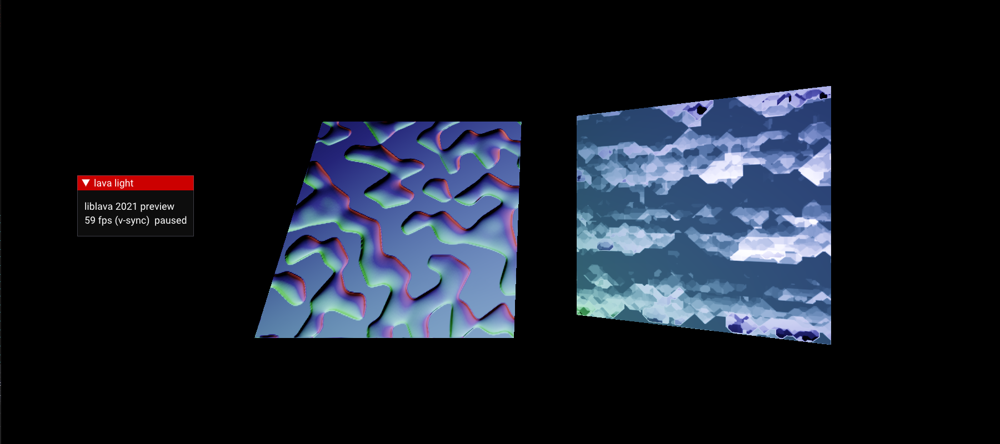
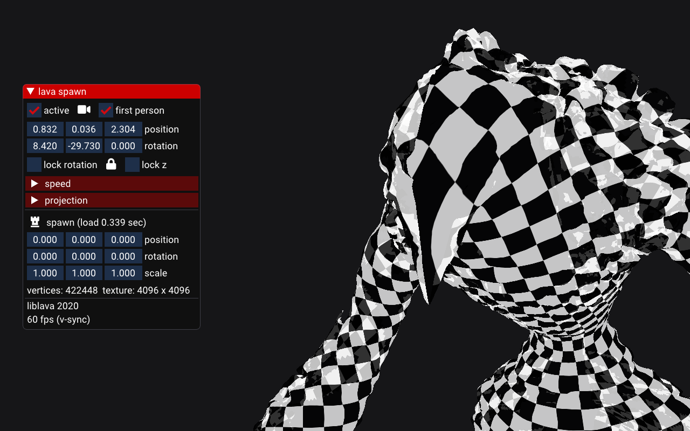
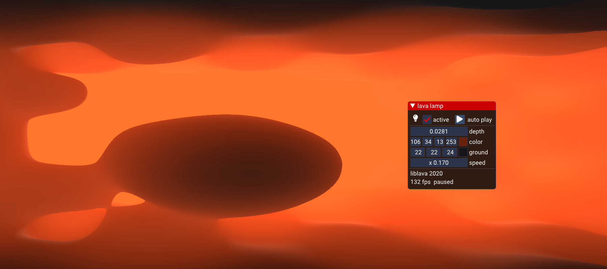
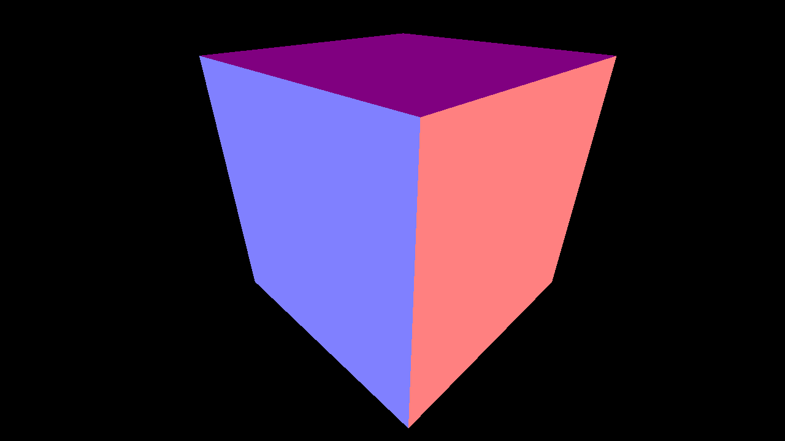
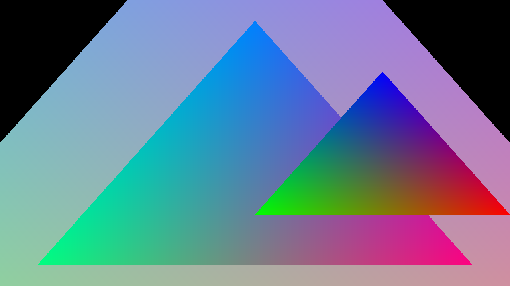
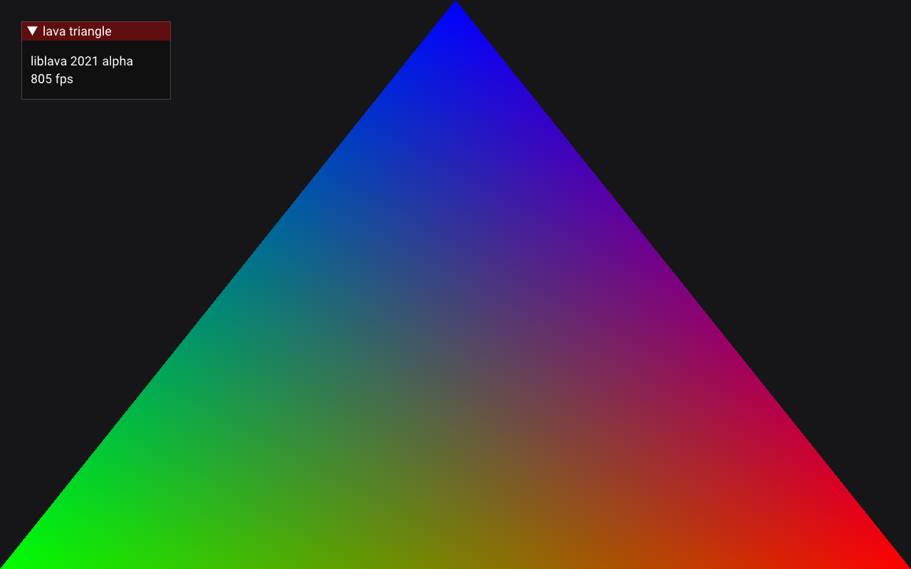

<br />

<a href="https://git.io/liblava">
    
</a>

<br />

<a href="https://git.io/liblava"></a>

**A modern and easy-to-use library for the Vulkan® API**

<br />

[](https://github.com/liblava/liblava/tags) [](#license) [](https://www.codefactor.io/repository/github/liblava/liblava) [](https://discord.lava-block.com) [](https://donate.lava-block.com) [](https://twitter.com/liblava)


`lava` is a lean framework that provides **essentials** for **low-level graphics** - specially well suited for **prototyping**, **tooling**, **profiling** and **education**. This library is written in **modern C++20** and strives for a **modular rolling release** as far as possible. We don't want to promise too much, but it runs really smoothly on **Windows** and **Linux**.

<br />

 ➜ &nbsp; **[Download](https://github.com/liblava/liblava/releases)** &nbsp; • &nbsp; [Introduction](#in-a-nutshell) &nbsp; • &nbsp; [Guide](#guide) &nbsp; • &nbsp; [Build](#build) &nbsp; • &nbsp; [Collaborate](#collaborate) &nbsp; • &nbsp; [Third-Party](#third-party)

<br />

**Modules**

[](#lava-core) [](#lava-util) [](#lava-file) [](#lava-base) [](#lava-resource) [](#lava-asset) [](#lava-frame) [](#lava-block) [](#lava-app) [](#lava-engine)

<br />

<br />

# Demos

| deferred shading + offscreen rendering | uniform buffer + camera | 
|:---------|---------:|
| <a href="liblava-demo/light.cpp"></a> | <a href="liblava-demo/spawn.cpp"></a> | 
| [](liblava-demo/light.cpp) | [](liblava-demo/spawn.cpp)  | 

<br />

| push constants ➜ shader | generating primitives | 
|:---------|---------:|
| <a href="liblava-demo/lamp.cpp"></a> | <a href="liblava-demo/shapes.cpp"></a> | 
| [](liblava-demo/lamp.cpp) | [](liblava-demo/shapes.cpp) | 

<br />

| float, double & int meshes | unique classic mesh | 
|:---------|---------:|
| <a href="liblava-demo/generics.cpp"></a> | <a href="liblava-demo/triangle.cpp"></a> | 
| [](liblava-demo/generics.cpp) | [](liblava-demo/triangle.cpp) | 

<br />

<br />

# Projects

| raytraced reflecting cubes ➜ [pezcode/lava-rt](https://github.com/pezcode/lava-rt) | 
|:---------|
| <a href="https://github.com/pezcode/lava-rt/blob/main/demo/cubes.cpp"> </a> | 
| [](https://github.com/pezcode/lava-rt/blob/main/demo/cubes.cpp) |

<br />

<br />

# In a nutshell

<a href="#3-modules">
    
</a>

* written in **modern C++** with latest **Vulkan support**
* **run loop** abstraction for **window** and **input** handling
* plain **renderer** and  **command buffer** model
* **texture** and **mesh** loading from **virtual file system**
* **camera**, **imgui**, **logger** and more...

<br />

# Introduction

*WIP*

<br />

## Tutorial

<a href="https://www.vulkan.org/" target="_blank"></a>

**Hello World** in **Vulkan**? &nbsp; Let's go!

*a simple app that renders a colored window*

<br />

All we need is a `window` + `device` and `renderer`

<br />

**Vulkan** is a low-level, verbose graphics API and such a program can take several hundred lines of code.

The good news is that **liblava** can help you.

<br />

<br />

**New to Vulkan?** ➜ Take a look at this [Vulkan Guide](https://github.com/KhronosGroup/Vulkan-Guide)

Check [Awesome Vulkan ecosystem](http://www.vinjn.com/awesome-vulkan/) for tutorials, samples and books.

<br />

<br />

```c++
#include <liblava/lava.hpp>

using namespace lava;
```
<br />

Here are a few **examples** to get to know `lava`

<br />

### 1. frame

```c++
int main(int argc, char* argv[]) {

    lava::frame frame( {argc, argv} );
    
    return frame.ready() ? 0 : error::not_ready;
}
```

This is how to initialize [](liblava/frame/frame.hpp) with command line arguments.

<br />

### 2. run loop

```c++
lava::frame frame(argh);
if (!frame.ready())
    return error::not_ready;

ui32 count = 0;

frame.add_run([&](id::ref run) {
    sleep(one_second);
    count++;

    log()->debug("{} - running {} sec", count, frame.get_running_time_sec());

    if (count == 3)
        return frame.shut_down();

    return run_continue;
});

return frame.run();
```

The last line performs a loop with the **run** we added before - If *count* reaches 3 that **loop** will exit.

<br />

### 3. window input

Here is another example that shows how to create [](liblava/frame/window.hpp) and handle [](liblava/frame/input.hpp)

```c++
lava::frame frame(argh);
if (!frame.ready())
    return error::not_ready;

lava::window window;
if (!window.create())
    return error::create_failed;

lava::input input;
window.assign(&input);

input.key.listeners.add([&](key_event::ref event) {
    if (event.pressed(key::escape))
        return frame.shut_down();
    
    return input_ignore;
});

frame.add_run([&](id::ref run) {
    input.handle_events();

    if (window.close_request())
        return frame.shut_down();

    return run_continue;
});

return frame.run();
```

<br />

Straightforward ➜ With this knowledge in hand let's write our **Hello World**...

<br />

### 4. clear color

```c++
lava::frame frame(argh);
if (!frame.ready())
    return error::not_ready;

lava::window window;
if (!window.create())
    return error::create_failed;

lava::input input;
window.assign(&input);

input.key.listeners.add([&](key_event::ref event) {
    if (event.pressed(key::escape))
        return frame.shut_down();

    return input_ignore;
});

lava::device_p device = frame.platform.create_device();
if (!device)
    return error::create_failed;

lava::render_target::ptr render_target = create_target(&window, device);
if (!render_target)
    return error::create_failed;

lava::renderer renderer;
if (!renderer.create(render_target->get_swapchain()))
    return error::create_failed;

ui32 frame_count = render_target->get_frame_count();

VkCommandPool cmd_pool;
VkCommandBuffers cmd_bufs(frame_count);

auto build_cmd_bufs = [&]() {
    if (!device->vkCreateCommandPool(device->graphics_queue().family, &cmd_pool))
        return build_failed;

    if (!device->vkAllocateCommandBuffers(cmd_pool, frame_count, cmd_bufs.data()))
        return build_failed;

    VkCommandBufferBeginInfo const begin_info{
        .sType = VK_STRUCTURE_TYPE_COMMAND_BUFFER_BEGIN_INFO,
        .flags = VK_COMMAND_BUFFER_USAGE_SIMULTANEOUS_USE_BIT,
    };

    VkClearColorValue const clear_color = { 
        random(1.f), random(1.f), random(1.f), 0.f 
    };

    VkImageSubresourceRange const image_range{
        .aspectMask = VK_IMAGE_ASPECT_COLOR_BIT,
        .levelCount = 1,
        .layerCount = 1,
    };

    for (auto i = 0u; i < frame_count; ++i) {
        VkCommandBuffer cmd_buf = cmd_bufs[i];
        VkImage frame_image = render_target->get_image(i);

        if (failed(device->call().vkBeginCommandBuffer(cmd_buf, &begin_info)))
            return build_failed;

        insert_image_memory_barrier(device,
                                    cmd_buf,
                                    frame_image,
                                    VK_ACCESS_MEMORY_READ_BIT,
                                    VK_ACCESS_TRANSFER_WRITE_BIT,
                                    VK_IMAGE_LAYOUT_UNDEFINED,
                                    VK_IMAGE_LAYOUT_TRANSFER_DST_OPTIMAL,
                                    VK_PIPELINE_STAGE_TRANSFER_BIT,
                                    VK_PIPELINE_STAGE_TRANSFER_BIT,
                                    image_range);

        device->call().vkCmdClearColorImage(cmd_buf,
                                            frame_image,
                                            VK_IMAGE_LAYOUT_TRANSFER_DST_OPTIMAL,
                                            &clear_color,
                                            1,
                                            &image_range);

        insert_image_memory_barrier(device,
                                    cmd_buf,
                                    frame_image,
                                    VK_ACCESS_TRANSFER_WRITE_BIT,
                                    VK_ACCESS_MEMORY_READ_BIT,
                                    VK_IMAGE_LAYOUT_TRANSFER_DST_OPTIMAL,
                                    VK_IMAGE_LAYOUT_PRESENT_SRC_KHR,
                                    VK_PIPELINE_STAGE_TRANSFER_BIT,
                                    VK_PIPELINE_STAGE_BOTTOM_OF_PIPE_BIT,
                                    image_range);

        if (failed(device->call().vkEndCommandBuffer(cmd_buf)))
            return build_failed;
    }

    return build_done;
};

auto clean_cmd_bufs = [&]() {
    device->vkFreeCommandBuffers(cmd_pool, frame_count, cmd_bufs.data());
    device->vkDestroyCommandPool(cmd_pool);
};

if (!build_cmd_bufs())
    return error::create_failed;

render_target->on_swapchain_start = build_cmd_bufs;
render_target->on_swapchain_stop = clean_cmd_bufs;

frame.add_run([&](id::ref run) {
    input.handle_events();

    if (window.close_request())
        return frame.shut_down();

    if (window.resize_request())
        return window.handle_resize();

    optional_index current_frame = renderer.begin_frame();
    if (!current_frame.has_value())
        return run_continue;

    return renderer.end_frame({ cmd_bufs[*current_frame] });
});

frame.add_run_end([&]() {
    clean_cmd_bufs();

    renderer.destroy();
    render_target->destroy();
});

return frame.run();
```

<br />

Welcome on **Planet Vulkan** - That's a lot to display a colored `window`

<br />
 
Take a closer look at the `build_cmd_bufs` function:

* We create a **command pool** and **command buffers** for each **frame** of the **render target**
* And set each **command buffer** to clear the **frame image** with some random color

`clean_cmd_bufs` **frees all buffers** and **destroys** the **command pool**.

<br />

**Note:** &nbsp; In case of **swap chain** restoration we simply **recreate command buffers** with a new random color - This happens for example on `window` resize.

<br />

The flag *VK_COMMAND_BUFFER_USAGE_SIMULTANEOUS_USE_BIT* specifies the usage of **command buffers** in such a way that they can *no longer* be changed - And therefore it is a very *static* example.

**Vulkan** supports a more *dynamic* and common usage by **resetting a command pool** before **recording new commands**.

<br />

Ok, it's time for [](liblava/block/block.hpp)

<br />

### 5. color block

```c++
lava::block block;

if (!block.create(device, frame_count, device->graphics_queue().family))
    return error::create_failed;

block.add_command([&](VkCommandBuffer cmd_buf) {
    VkClearColorValue const clear_color = {
        random(1.f), random(1.f), random(1.f), 0.f
    };

    VkImageSubresourceRange const image_range{
        .aspectMask = VK_IMAGE_ASPECT_COLOR_BIT,
        .levelCount = 1,
        .layerCount = 1,
    };

    VkImage frame_image = render_target->get_image(block.get_current_frame());

    insert_image_memory_barrier(device,
                                cmd_buf,
                                frame_image,
                                VK_ACCESS_MEMORY_READ_BIT,
                                VK_ACCESS_TRANSFER_WRITE_BIT,
                                VK_IMAGE_LAYOUT_UNDEFINED,
                                VK_IMAGE_LAYOUT_TRANSFER_DST_OPTIMAL,
                                VK_PIPELINE_STAGE_TRANSFER_BIT,
                                VK_PIPELINE_STAGE_TRANSFER_BIT,
                                image_range);

    device->call().vkCmdClearColorImage(cmd_buf,
                                        frame_image,
                                        VK_IMAGE_LAYOUT_TRANSFER_DST_OPTIMAL,
                                        &clear_color,
                                        1,
                                        &image_range);

    insert_image_memory_barrier(device,
                                cmd_buf,
                                frame_image,
                                VK_ACCESS_TRANSFER_WRITE_BIT,
                                VK_ACCESS_MEMORY_READ_BIT,
                                VK_IMAGE_LAYOUT_TRANSFER_DST_OPTIMAL,
                                VK_IMAGE_LAYOUT_PRESENT_SRC_KHR,
                                VK_PIPELINE_STAGE_TRANSFER_BIT,
                                VK_PIPELINE_STAGE_BOTTOM_OF_PIPE_BIT,
                                image_range);
});
```

<br />

This is much more simpler than before!

<br />

➜ We create a `block` with a `command` that **clears** the **current frame image**.

<br />

All we need to do now is to process that `block` in the **run** loop:

```c++
if (!block.process(*current_frame))
    return run_abort;

return renderer.end_frame(block.get_buffers());
```

And call the `renderer` with our recorded **command buffers**.

<br />

**Note:** &nbsp; Don't forget to *clean* it up when the **run** ends:

```c++
block.destroy();
```

<br />

### 6. imgui demo

[](liblava/app/app.hpp) supports [Dear ImGui](https://github.com/ocornut/imgui) for **tooling** and **easy prototyping**.

```c++
int main(int argc, char* argv[]) {

    lava::app app("demo", { argc, argv });
    if (!app.setup())
        return error::not_ready;

    app.imgui.on_draw = []() {

        ImGui::ShowDemoWindow();
    };

    return app.run();
}
```

<br />

<br />

**What's next?** ➜ Check some [demo](liblava-demo) or use the [template](#template) to try it out!

<br />

<br />

# Guide

1. [Lifetime of an Object](#1-lifetime-of-an-object)
2. [Making Meshes](#2-making-meshes)
3. [Modules](#3-modules)
4. [Reference](#4-reference)
5. [Test](#5-test)
6. [Keyboard Shortcuts](#6-keyboard-shortcuts)
7. [Command-Line Arguments](#7-command-line-arguments)

<br />

## 1. Lifetime of an Object

Before you create new objects or use existing ones, you should get familiar with the lifetime of objects.

It is basically possible to create all objects in **liblava** on the stack or on the heap.

But be careful. You have to take care of the lifetime yourself.

<br />

**make &nbsp; ➜ &nbsp; create &nbsp; ➜ &nbsp; destroy**

This is the general pattern that is used in this library:

1. **make** &nbsp; Use constructor or factory method *(static function to get a shared pointer)*
2. **create** &nbsp; Build the respective object
3. **destroy** &nbsp; Discard it after your use

The destructor calls the **destroy** method if it was *not* called before.

<br />

### Example: buffer object

```c++
void use_buffer_on_stack() {

    buffer buf; // make

    auto created = buf.create(device, data, size, usage);
    if (created) {
        // ...

        buf.destroy();
    }
}
```

Or look at this method where it is returned as a *shared pointer*:

```c++
buffer::ptr use_buffer_on_heap() {

    auto buf = make_buffer();

    if (buf->create(device, data, size, usage))
        return buf;

    return nullptr;
}
```

<br />

## 2. Making Meshes

**liblava** provides a `mesh` struct that contains a list of vertices and *optionally* a list of indices.

It is made this way:

```c++
mesh::ptr my_mesh = make_mesh();

my_mesh->add_data( /* Pass in a lava::mesh_data object */ );
my_mesh->create(device);
```

<br />

**liblava** prepares a `create_mesh()` function to simplify the **creation of primitives**.

It takes a `mesh_type` argument to specify what kind of primitive to build:

`cube` &nbsp; `triangle` &nbsp; `quad` &nbsp; `hexagon` &nbsp; `none`

<br />

The function is called in this way:

```c++
mesh::ptr cube;
cube = create_mesh(device, mesh_type::cube);
```

<br />

By default, vertices in a `mesh` are of type `vertex` which has the following **layout**:

```c++
struct vertex {
    v3 position;
    v4 color;
    v2 uv;
    v3 normal;
}
```

<br />

**Meshes** are templated and can represent **any vertex struct** definition, like here:

```c++
struct int_vertex {
    std::array<i32, 3> position;
    v4 color;
};
mesh_template<int_vertex>::ptr int_triangle;
```

<br />

`create_mesh()` can generate primitives for arbitrary vertex structs too. Provided that the struct contains an array or vector member named `position`:

```c++
int_triangle = create_mesh<int_vertex>(device, mesh_type::triangle);
```

<br />

`create_mesh()` may also initialize **Color**, **Normal**, and **UV** data automatically.

However, it will only initialize these if there are corresponding `color`, `normal`, and/or `uv` fields defined in the vertex struct.

By default, it will initialize everything automatically. But if generating any of this data is not desired, the fields can be individually disabled by **template arguments** in this order:

1. **Color**
2. **Normal**
3. **UV**

```c++
struct custom_vertex {
    v3 position;
    v3 color;
    v3 normal;
    v2 uv;
};
mesh_template<custom_vertex>::ptr triangle;

// Generate three vertices with positions and uvs, but not colors or normals
triangle = create_mesh<custom_vertex, false, false, true>
                      (device, mesh_type::triangle);
```

**Note:** &nbsp; Cubes generated this way have a special case. If they are initialized with normal data, they will be represented by 24 vertices. Otherwise, only 8 vertices will be initialized.

<br />

## 3. Modules

### lava [engine](liblava/engine)

*require* [app](#lava-app)

[](liblava/engine/engine.hpp) [](liblava/engine/producer.hpp) [](liblava/engine/property.hpp)

### lava [app](liblava/app)

*require* [block](#lava-block) + [frame](#lava-frame) + [asset](#lava-asset)

[](liblava/app/app.hpp) [](liblava/app/camera.hpp) [](liblava/app/forward_shading.hpp)

[](liblava/app/benchmark.hpp) [](liblava/app/config.hpp) [](liblava/app/imgui.hpp)

### lava [block](liblava/block)

*require* [base](#lava-base)

[](liblava/block/attachment.hpp) [](liblava/block/block.hpp) [](liblava/block/descriptor.hpp) [](liblava/block/render_pass.hpp) [](liblava/block/subpass.hpp)

[](liblava/block/compute_pipeline.hpp) [](liblava/block/graphics_pipeline.hpp) [](liblava/block/pipeline.hpp) [](liblava/block/pipeline_layout.hpp)

### lava [frame](liblava/frame)

*require* [resource](#lava-resource)

[](liblava/frame/argh.hpp) [](liblava/frame/driver.hpp) [](liblava/frame/frame.hpp) [](liblava/frame/gamepad.hpp) [](liblava/frame/input.hpp) [](liblava/frame/window.hpp)

[](liblava/frame/render_target.hpp) [](liblava/frame/renderer.hpp) [](liblava/frame/swapchain.hpp)

### lava [asset](liblava/asset)

*require* [resource](#lava-resource) + [file](#lava-file)

[](liblava/asset/image_loader.hpp) [](liblava/asset/load_mesh.hpp) [](liblava/asset/load_texture.hpp) [](liblava/asset/write_image.hpp)

### lava [resource](liblava/resource)

*require* [base](#lava-base)

[](liblava/resource/buffer.hpp) [](liblava/resource/mesh.hpp) [](liblava/resource/primitive.hpp)

[](liblava/resource/format.hpp) [](liblava/resource/image.hpp) [](liblava/resource/texture.hpp)

### lava [base](liblava/base)

*require* [util](#lava-util)

[](liblava/base/base.hpp) [](liblava/base/instance.hpp) [](liblava/base/profile.hpp) [](liblava/base/memory.hpp)

[](liblava/base/platform.hpp) [](liblava/base/device.hpp) [](liblava/base/physical_device.hpp) [](liblava/base/queue.hpp)

### lava [file](liblava/file)

*require* [util](#lava-util)

[](liblava/file/file.hpp) [](liblava/file/file_system.hpp) [](liblava/file/file_utils.hpp) [](liblava/file/json_file.hpp) [](liblava/file/json.hpp)

### lava [util](liblava/util)

*require* [core](#lava-core)

[](liblava/util/log.hpp) [](liblava/util/random.hpp) [](liblava/util/telegram.hpp) [](liblava/util/thread.hpp) [](liblava/util/utility.hpp)

### lava [core](liblava/core)

[](liblava/core/data.hpp) [](liblava/core/hex.hpp) [](liblava/core/id.hpp) [](liblava/core/math.hpp) [](liblava/core/time.hpp) [](liblava/core/types.hpp) [](liblava/core/version.hpp)

<br />

## 4. Reference

To generate the documentation with [Doxygen](https://www.doxygen.nl) run:

```bash
doxygen tool/doxygen.conf
```

Here you can find the **latest** ➜ [doc.lava-block.com](https://doc.lava-block.com)

<br />

## 5. Test

Run the `lava` executable to test our [Tutorial](#tutorial) examples ➜ so called **stages**.

<br />

### List all stages

```bash
lava -ls

lava --stages
```

1. [frame](#1-frame)
2. [run loop](#2-run-loop)
3. [window input](#3-window-input)
4. [clear color](#4-clear-color)
5. [color block](#5-color-block)
6. [imgui demo](#6-imgui-demo)
7. **forward shading**
8. **gamepad**

<br />

[Here](liblava-stage/tutorial.cpp) you can find the complete source code - The **last stages** in this list are further [examples](liblava-stage/examples.cpp)

<br />

#### Run example *window input*

```bash
lava -s=3

lava --stage=3
```

**Note:** &nbsp; If you run `lava` without arguments - the *last stage* will be started.

<br />

### Unit testing

In addition run `lava-test` to check some **unit tests** with [Catch2](https://github.com/catchorg/Catch2)

<br />

### Template

Put your code in the [src](src) folder and begin to code in [main.cpp](src/main.cpp)

<br />

**Note:** &nbsp; You can change the project name in **CMake** ➜ `LIBLAVA_TEMPLATE_NAME` 

```bash
cmake -DLIBLAVA_TEMPLATE_NAME="My-Project" ..
```

<br />

## 6. Keyboard Shortcuts

[](liblava/app/app.hpp) defines some *shortcuts* for common **actions**:

<br />

| shortcut          |         action | default |         config.json |
| :---------------- | -------------: | :------ | ------------------: |
| *alt + enter*     | **fullscreen** | off     | "window/fullscreen" |
| *alt + backspace* |     **v-sync** | off     |        "app/v-sync" |
| *control + tab*   |      **imgui** | on      |         "app/imgui" |
| *control + space* |      **pause** | off     |        "app/paused" |
| *control + b*     |  **benchmark** |         |                     |
| *control + p*     | **screenshot** |         |                     |
| *control + q*     |       **quit** |         |                     |

<br />

**Note:** &nbsp; You can disable these actions by simply turning them off:

`app.config.handle_key_events = false;`

<br />

## 7. Command-Line Arguments

### app

```
--clean, -c
```

* **clean** preferences folder

<br />

```
--clean_cache, -cc
```

* **clean** cache folder

<br />

```
--v_sync={0|1}, -vs={0|1}
```

* **0** &nbsp; vertical sync off
* **1** &nbsp; vertical sync on

<br />

```
--physical_device={n}, -pd={n}
```

* **n** &nbsp; physical device index &nbsp; *default: n = 0*

<br />

```
--identification={str}, -id={str}
```

* **str** &nbsp; config save name &nbsp; *supports punctuation marks*

<br />

```
--paused={0|1}, -p={0|1}
```

* **0** &nbsp; running
* **1** &nbsp; paused

<br />

```
--delta={n}, -d={n}
```

* **n** &nbsp; fixed delta in milliseconds &nbsp; *disable: n = 0*

<br />

```
--speed={n}, -s={n}
```

* **n** &nbsp; runtime speed &nbsp; *default: n = 1.0*

<br />

```
--imgui={0|1}, -ig={0|1}
```

* **0** &nbsp; hide imgui
* **1** &nbsp; show imgui


<br />

```
--fullscreen={0|1}, -wf={0|1}
```

* **0** &nbsp; windowed mode
* **1** &nbsp; fullscreen mode

<br />

```
--x_pos={n}, -wx={n}
```

* **n** &nbsp; window x position

<br />

```
--y_pos={n}, -wy={n}
```

* **n** &nbsp; window y position

<br />

```
--width={n}, -ww={n}
```

* **n** &nbsp; window width

<br />

```
--height={n}, -wh={n}
```

* **n** &nbsp; window height

<br />

```
--center, -wc
```

* **center** window on the monitor

<br />

#### Benchmark

[](liblava/app/app.hpp)  writes frame times *(durations in milliseconds)* into a `json` file to analyze them further for automated workflows like benchmarks:

```json
{
  "benchmark": {
    "avg": 16.02839111337229,
    "count": 622,
    "max": 45,
    "min": 12,
    "offset": 5000,
    "time": 10000
  },
  "frames": [
    12,
    14,
    16,
    16
  ],
  "timestamps": [
    5,
    17,
    31,
    47,
    63
  ]
}
```

<br />

```
--benchmark, -bm
```

* **activate** benchmark mode

<br />

```
--benchmark_time={n}, -bmt={n}
```

* **n** &nbsp; benchmark duration in milliseconds &nbsp; *default: n = 10000 ms*

<br />

```
--benchmark_offset={n}, -bmo={n}
```

* **n** &nbsp; warm up time in milliseconds &nbsp; *default: n = 5000 ms*

<br />

```
--benchmark_file={str}, -bmf={str}
```

* **str** &nbsp; output file &nbsp; *default: str = benchmark.json*

<br />

```
--benchmark_path={str}, -bmp={str}
```

* **str** &nbsp; output path &nbsp; *default: preferences folder*

<br />

```
--benchmark_exit={0|1}, -bmx={0|1}
```

* **0** &nbsp; keep running after benchmark
* **1** &nbsp; close app after benchmark &nbsp; *default*

<br />

```
--benchmark_buffer={n}, -bmb={n}
```

* **n** &nbsp; pre-allocated buffer size for results &nbsp; *default: n = 100000*

<br />

### frame

You need the [Vulkan SDK](https://vulkan.lunarg.com) installed for debugging.

<br />

```
--debug, -d
```

* **enable** validation layer &nbsp; *[VK_LAYER_KHRONOS_validation](https://github.com/KhronosGroup/Vulkan-ValidationLayers/blob/master/docs/khronos_validation_layer.md)*

<br />

```
--utils, -u
```

* **enable** debug utils extension &nbsp; *[VK_EXT_debug_utils](https://www.lunarg.com/wp-content/uploads/2018/05/Vulkan-Debug-Utils_05_18_v1.pdf)*

<br/>

```
--renderdoc, -r
```

* **enable** [RenderDoc](https://renderdoc.org/) capture layer &nbsp; *VK_LAYER_RENDERDOC_Capture*

<br />

```
--log={0|1|2|3|4|5|6}, -l={0|1|2|3|4|5|6}
```

* level **0** &nbsp; trace &nbsp; *verbose logging*
* level **1** &nbsp; debug
* level **2** &nbsp; info
* level **3** &nbsp; warn
* level **4** &nbsp; error
* level **5** &nbsp; critical
* level **6** &nbsp; off &nbsp; *logging disabled*

<br />

<br />

**Need help?** &nbsp; Please feel free to ask us on ➜ [Discord](https://discord.lava-block.com)

<br />

<br />

# Build

[](https://github.com/liblava/liblava/actions/workflows/cmake.yml)

## Requirements

* **C++20** compatible compiler
* CMake **3.22+**
* [Python 3](http://www.python.org) &nbsp; *for utility scripts*
* [Vulkan SDK](https://vulkan.lunarg.com) &nbsp; *for debugging only*

<br />

```bash
git clone https://github.com/liblava/liblava.git
cd liblava

mkdir build
cd build

cmake ..
cmake --build . --parallel
```

<br />

## Install

You can use **liblava** as a *git submodule* in your project:

```bash
git submodule add https://github.com/liblava/liblava.git
```

Add this to your `CMakeLists.txt`

```cmake
add_subdirectory(${CMAKE_CURRENT_SOURCE_DIR}/liblava ${CMAKE_CURRENT_BINARY_DIR}/liblava)

...

target_link_libraries(${PROJECT_NAME} PRIVATE lava::engine ${LIBLAVA_ENGINE_LIBRARIES})
```

<br />

### Package setup

Alternatively ➜ compile and install a specific version for multiple projects:

```bash
mkdir build
cd build

cmake -D CMAKE_BUILD_TYPE=Release -D CMAKE_INSTALL_PREFIX=../lava-install ..
cmake --build . --config Release --target install --parallel
```

First find the package in your `CMakeLists.txt`

```cmake
find_package(lava 0.7.1 REQUIRED)

...

target_link_libraries(${PROJECT_NAME} PRIVATE lava::engine ${LIBLAVA_ENGINE_LIBRARIES})
```

And then build your project with install path ➜ *lava_DIR*

```bash
mkdir build
cd build

cmake -D lava_DIR=path/to/lava-install/lib/cmake/lava ..
cmake --build . --parallel
```

<br />

### Installing and using Vcpkg

[Vcpkg](https://github.com/microsoft/vcpkg) integration with 2 options ➜ use this [registry and port](https://github.com/liblava/vcpkg-liblava)

<br />

### Conan Package Manager

If you are familiar with [Conan](https://conan.io/) ➜ build this [package recipe](https://github.com/liblava/conan-liblava)

<br />

<br />

# Collaborate

Use the [issue tracker](https://github.com/liblava/liblava/issues) to report any bug or compatibility issue.

:heart: &nbsp; Thanks to all **[contributors](https://github.com/liblava/liblava/graphs/contributors)** making **liblava** flow...

<br />

If you want to contribute - we suggest the following:

1. Fork the [official repository](https://github.com/liblava/liblava/fork)
2. Apply your changes to your fork
3. Submit a [pull request](https://github.com/liblava/liblava/pulls) describing the changes you have made

<br />

## Support

<br />

| [](https://donate.lava-block.com) | [](https://github.com/liblava/liblava/stargazers) &nbsp; [](https://twitter.com/liblava) |
|:---------|---------:|
| help **maintenance** and further **development**  | **every star** and **follow** motivates | 

<br />

<br />

# Third-Party

You can update all **external modules** by running the script:

```bash
python tool/update.py > tool/version.json
```

<br />

* [argh](https://github.com/adishavit/argh) &nbsp; **Argh! A minimalist argument handler** &nbsp; *3-clause BSD*

  [](liblava/frame/argh.hpp)

* [Catch2](https://github.com/catchorg/Catch2) &nbsp; **A modern, C++-native, header-only, test framework for unit-tests, TDD and BDD** &nbsp; *BSL 1.0*

* [CPM.cmake](https://github.com/cpm-cmake/CPM.cmake) &nbsp; **A small CMake script for setup-free, cross-platform, reproducible dependency management** &nbsp; *MIT*

* [glfw](https://github.com/glfw/glfw) &nbsp; **A multi-platform library for OpenGL, OpenGL ES, Vulkan, window and input** &nbsp; *zlib*

  [](liblava/frame/frame.cpp) [](liblava/frame/gamepad.cpp) [](liblava/frame/input.cpp) [](liblava/frame/window.cpp)

* [gli](https://github.com/g-truc/gli) &nbsp; **OpenGL Image (GLI)** &nbsp; *MIT*

  [](liblava/asset/load_texture.cpp)

* [glm](https://github.com/g-truc/glm) &nbsp; **OpenGL Mathematics (GLM)** &nbsp; *MIT*

  [](liblava/core/math.hpp)

* [glslang](https://github.com/KhronosGroup/glslang) &nbsp; **Khronos-reference front end for GLSL/ESSL, partial front end for HLSL, and a SPIR-V generator** &nbsp; *3-clause BSD*

* [IconFontCppHeaders](https://github.com/juliettef/IconFontCppHeaders) &nbsp; **C, C++ headers and C# classes for icon fonts** &nbsp; *zlib*

  [](liblava/app/imgui.cpp)

* [imgui](https://github.com/ocornut/imgui) &nbsp; **Dear ImGui - Bloat-free Graphical User interface for C++ with minimal dependencies** &nbsp; *MIT*

  [](liblava/app/imgui.cpp)

* [json](https://github.com/nlohmann/json) &nbsp; **JSON for Modern C++** &nbsp; *MIT*

  [](liblava/file/json.hpp)

* [physfs](https://github.com/icculus/physfs) &nbsp; **A portable, flexible file i/o abstraction** &nbsp; *zlib*

  [](liblava/file/file.cpp) [](liblava/file/file_system.cpp)

* [shaderc](https://github.com/google/shaderc) &nbsp; **A collection of tools, libraries, and tests for Vulkan shader compilation** &nbsp; *Apache 2.0*

  [](liblava/engine/producer.cpp)

* [spdlog](https://github.com/gabime/spdlog) &nbsp; **Fast C++ logging library** &nbsp; *MIT*

  [](liblava/util/log.hpp)

* [SPIRV-Headers](https://github.com/KhronosGroup/SPIRV-Headers) &nbsp; **SPIRV Headers** &nbsp; *MIT*

* [SPIRV-Tools](https://github.com/KhronosGroup/SPIRV-Tools) &nbsp; **SPIRV Tools** &nbsp; *Apache 2.0*

* [stb](https://github.com/nothings/stb) &nbsp; **Single-file public domain libraries for C/C++** &nbsp; *MIT*

  [](liblava/asset/image_loader.cpp) [](liblava/asset/load_texture.cpp) [](liblava/asset/write_image.cpp)

* [tinyobjloader](https://github.com/syoyo/tinyobjloader) &nbsp; **Tiny but powerful single file wavefront obj loader** &nbsp; *MIT*

  [](liblava/asset/load_mesh.hpp)

* [volk](https://github.com/zeux/volk) &nbsp; **Meta loader for Vulkan API** &nbsp; *MIT*

  [](liblava/base/base.hpp)

* [Vulkan-Headers](https://github.com/KhronosGroup/Vulkan-Headers) &nbsp; **Vulkan Header files and API registry** &nbsp; *Apache 2.0*

  [](liblava/base/base.hpp) [](liblava/frame/window.hpp)

* [Vulkan-Profiles](https://github.com/KhronosGroup/Vulkan-Profiles) &nbsp; **Vulkan Profiles Tools** &nbsp; *Apache 2.0*

  [](liblava/base/profile.hpp)

* [VulkanMemoryAllocator](https://github.com/GPUOpen-LibrariesAndSDKs/VulkanMemoryAllocator) &nbsp; **Easy to integrate Vulkan memory allocation library** &nbsp; *MIT*

  [](liblava/base/memory.hpp)

<br />

## Demo

You can find the demonstration projects in the `liblava-demo` folder.

<br />

- **Roboto** &nbsp; ➜ &nbsp; [Website](https://fonts.google.com/specimen/Roboto) &nbsp; • &nbsp; [GitHub](https://github.com/google/fonts/tree/main/apache/roboto) &nbsp; *Apache License, Version 2.0* &nbsp; [Roboto-Regular.ttf](res/font/Roboto-Regular.ttf)
- **Font Awesome** &nbsp; ➜ &nbsp; [Website](https://fontawesome.com) &nbsp; • &nbsp; [GitHub](https://github.com/FortAwesome/Font-Awesome) &nbsp; *Font Awesome Free License* &nbsp; [fa-solid-900.ttf](res/font/icon/fa-solid-900.ttf)
- **Barbarella** &nbsp; ➜ &nbsp; [Website](https://www.shadertoy.com/view/XdfGDr) &nbsp; *Shader by Weyland Yutani* &nbsp; [lamp.frag](res/lamp/lamp.frag)
- **Spawn Model** &nbsp; ➜ &nbsp; [Website](https://opengameart.org/content/lava-spawn) &nbsp; *CC BY-SA 3.0* &nbsp; [lava-spawn-game.mtl](res/spawn/lava-spawn-game.mtl) &nbsp; • &nbsp; [lava-spawn-game.obj](res/spawn/lava-spawn-game.obj)

<br />

<br />

# License

<a href="https://opensource.org" target="_blank"></a>

**liblava** is licensed under [MIT License](LICENSE) which allows you to use the software
<br />
for any purpose you might like - including commercial and for-profit use.

<br />

However - this library includes several [Third-Party](#third-party) libraries which are licensed under their own respective **Open Source** licenses ➜ They all allow static linking with closed source software.

<br />

**All copies of liblava must include a copy of the MIT License terms and the copyright notice.**

Vulkan and the Vulkan logo are trademarks of the <a href="http://www.khronos.org" target="_blank">Khronos Group Inc.</a>

Copyright (c) 2018-present • <a href="https://lava-block.com">Lava Block OÜ</a> and [contributors](https://github.com/liblava/liblava/graphs/contributors)

<br />

<a href="https://git.io/liblava"></a>
