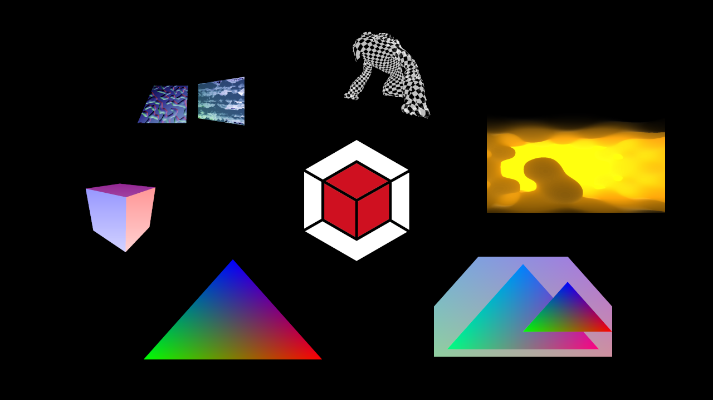

 

 

**A modern and easy-to-use library for the Vulkan® API**

 

   &nbsp;   

 

**lava**  provides **essentials** for **low-level graphics** - suited for **prototyping**, **tooling**, **profiling** and **education**. 

> **This lean framework** is written in **neat C++20** and it strives for a **modular rolling release** as far as possible. We *don't* want to promise too much... but **lava runs** really smoothly on **Windows** and **Linux**.

 

➜ &nbsp; [Download](https://github.com/liblava/liblava/releases) &nbsp; • &nbsp; [Documentation](https://liblava.github.io) (Tutorial / Guide) &nbsp; • &nbsp; [Projects](#projects) &nbsp; • &nbsp; [Modules](#modules) &nbsp; • &nbsp; [Collaborate](#collaborate)

 

# In a nutshell

* **liblava** is written in **modern C++** with latest **Vulkan support**
* Provides **run loop** abstraction for **window** and **input handling**
* **Texture** and **mesh** loading from **virtual file system**
* Plain **renderer** and  **command buffer model**
* Batteries included ➜ runtime **shader compilation**
* **Camera**, **imgui**, **logger** and much more...

 

# Demos

|  |    **free download on ➜** [itch.io](https://thelavablock.itch.io/lava-demo)    The collection includes all stages to play around. *You can easily switch between them.* ➜ [code](liblava-demo/main.cpp) |
|:-|:-|

## Stages

|||
|:-|:-|
|  |    **deferred shading + offscreen rendering**    Small demo that showcases how to render to an offscreen framebuffer and sample from it. *A challenge in itself and also a compact solution.* ➜ [code](liblava-demo/light.cpp) |
|  |    **uniform buffer + camera**    This loads a very large mesh object from file and simply textures it. *Use a gamepad to control the camera if there is one around.* ➜ [code](liblava-demo/spawn.cpp) |
|  |    **push constants to shader**   Classic lamp to relax where the color can also be easily switched. *Unfortunately it also consumes power - so be aware!* ➜ [code](liblava-demo/lamp.cpp) |
|  |    **generating primitives**    Switch between basic shapes and use the camera to fly around. *A great start for your interactive applications.* ➜ [code](liblava-demo/shapes.cpp) |
|  |    **float, double & int meshes**    This demo shows how to check GPU features and render mesh data with custom vertex layout. *There is a chapter about this in the Guide.* ➜ [code](liblava-demo/generics.cpp) |
|  |    **unique classic mesh**    Where graphics programming always begins. *A small example that illustrates how little it actually takes to render a triangle.* ➜ [code](liblava-demo/triangle.cpp) |
|||

 

# Projects

|  |    **raytraced reflecting cubes**    **Vulkan raytracing with liblava**  Support for the Vulkan KHR ray tracing extensions with idiomatic wrappers. ➜ [code](https://github.com/pezcode/lava-rt/blob/main/demo/cubes.cpp) |
|:-|:-|
| | *Do you have a project? Submit it with a [pull request](#collaborate)* |

 

# Modules

  &nbsp;   &nbsp;    &nbsp;    

 

 

## lava [engine](liblava/engine) 

  

- *require* [app](#lava-app)

## lava [app](liblava/app)

  

  

- *require* [block](#lava-block) + [frame](#lava-frame) + [asset](#lava-asset)

 

## lava [block](liblava/block)

    

   

- *require* [base](#lava-base)

## lava [frame](liblava/frame)

    

   

- *require* [resource](#lava-resource)

 

## lava [asset](liblava/asset)

   

- *require* [resource](#lava-resource) + [file](#lava-file)

## lava [resource](liblava/resource)

  

  

- *require* [base](#lava-base)

## lava [base](liblava/base)

   

   

- *require* [util](#lava-util)

 

## lava [file](liblava/file)

    

- *require* [util](#lava-util)

## lava [util](liblava/util)

    

- *require* [core](#lava-core)

## lava [core](liblava/core)

      

 

# Collaborate

Use the [issue tracker](https://github.com/liblava/liblava/issues) to report any bug or compatibility issue.

:heart: &nbsp; Thanks to all [contributors](https://github.com/liblava/liblava/graphs/contributors) making **liblava** flow...

 

 

If you want to **contribute** - we suggest the following:

1. Fork the [official repository](https://github.com/liblava/liblava/fork)
2. Apply your changes to **your fork**
3. Submit a [pull request](https://github.com/liblava/liblava/pulls) describing the changes you have made

 

## Support

 

| Help maintenance and development | Every star and follow motivates |
|---------:|:---------|
|  |  &nbsp;  |

 

# License

**liblava** is licensed under [MIT License](LICENSE) which allows you to use the software for any purpose you might like - including commercial and for-profit use. However - this library includes several [Third-Party](docs/README.md#Third-Party) libraries which are licensed under their own respective [Open Source](https://opensource.org) licenses ➜ They all allow **static linking** with closed source software.

> **All copies of liblava must include a copy of the MIT License terms and the copyright notice.**

 

**Vulkan** and the Vulkan logo are trademarks of the <a href="http://www.khronos.org" target="_blank">Khronos Group Inc.</a>

Copyright (c) 2018-present - <a href="https://lava-block.com">Lava Block OÜ</a> and [contributors](https://github.com/liblava/liblava/graphs/contributors)

 

 

